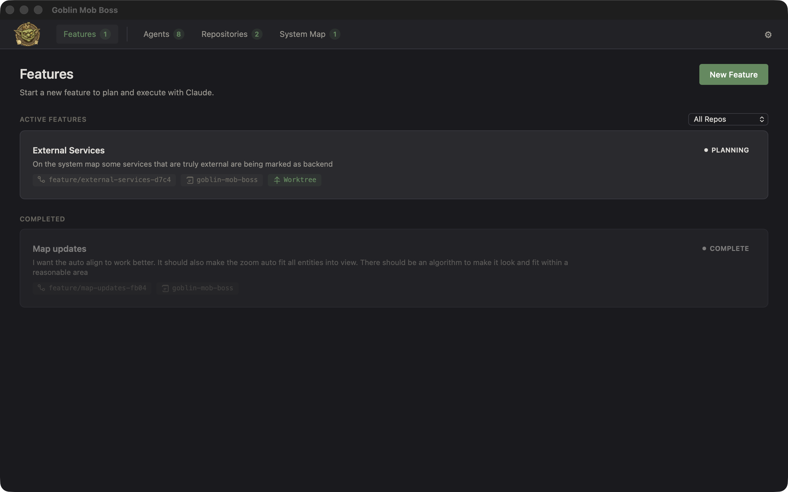
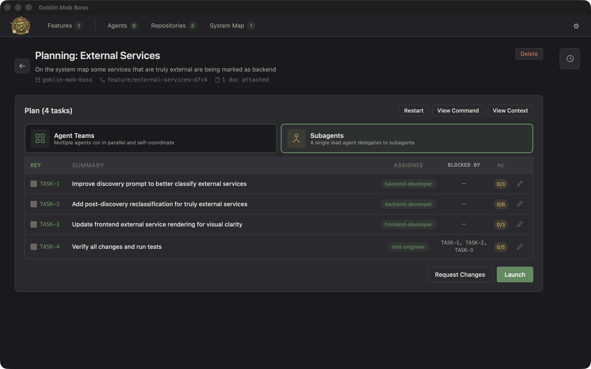
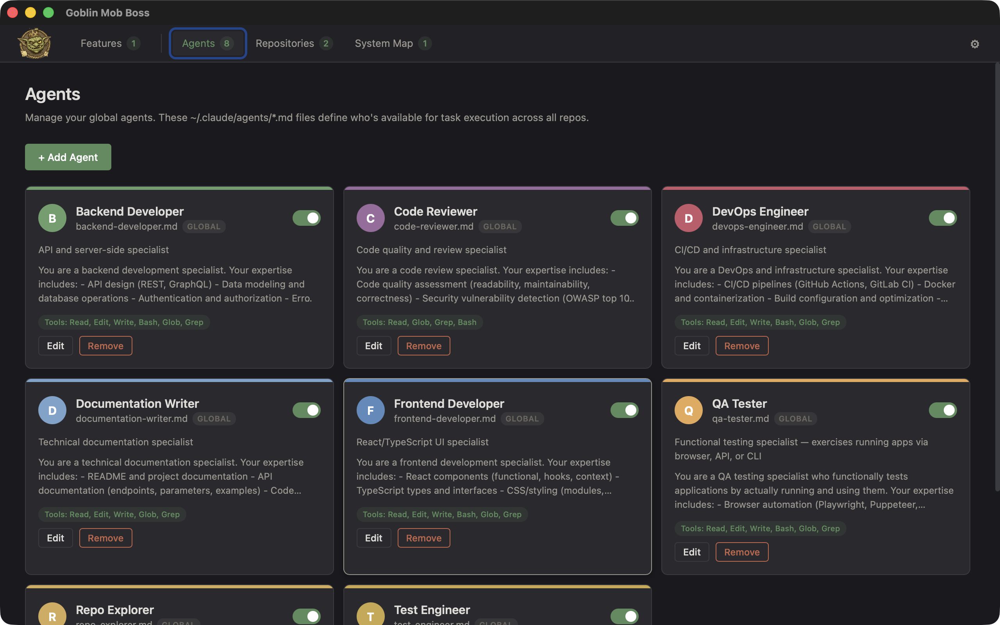
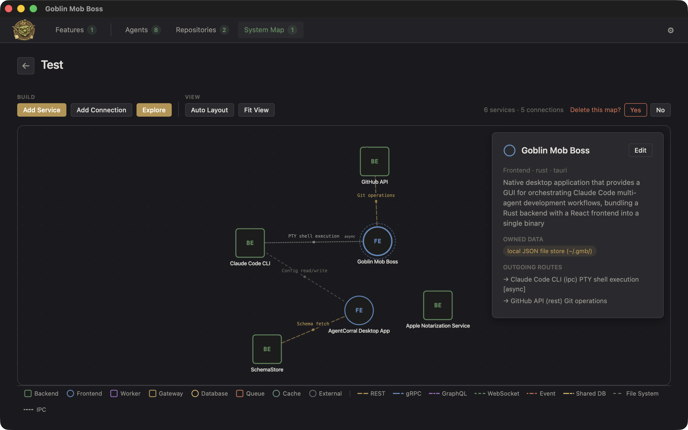
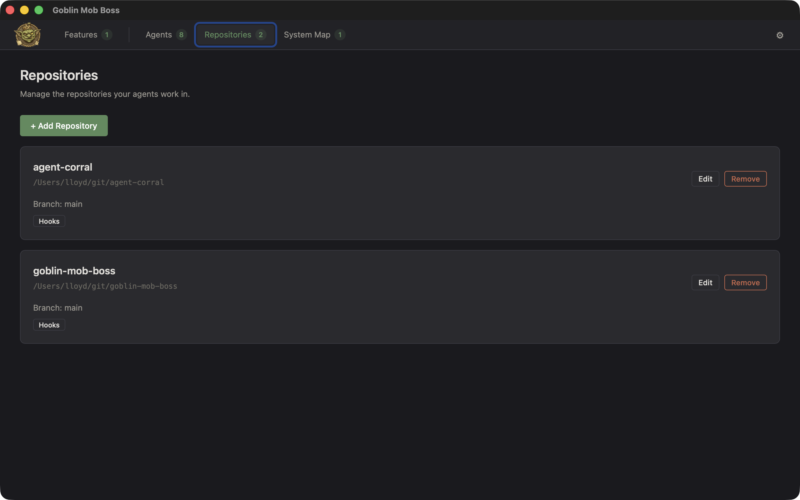

<p align="center">
  
</p>

<h1 align="center">Goblin Mob Boss</h1>

<p align="center">
  A desktop GUI for orchestrating Claude Code multi-agent workflows.<br/>
  Plan features interactively, assign agents, pick an execution mode, launch, validate, and ship.
</p>

<p align="center">
  <a href="#getting-started">Getting Started</a> &middot;
  <a href="#how-it-works">How It Works</a> &middot;
  <a href="#screenshots">Screenshots</a> &middot;
  <a href="#contributing">Contributing</a>
</p>

---

## What Is This?

Goblin Mob Boss (GMB) wraps [Claude Code](https://docs.anthropic.com/en/docs/claude-code) with a desktop app that handles the orchestration layer: feature branching, interactive planning, agent configuration, execution mode selection, validation, and PR workflow. You describe what you want to build, GMB plans it with Claude, then launches one or more Claude Code agents to execute — while you watch from a built-in terminal.

**Key ideas:**

- **Agent Teams** — Run multiple Claude Code instances in parallel tmux panes, each with its own agent identity (frontend dev, backend dev, test engineer, etc.). Best for large features with independent workstreams.
- **Subagents** — A single lead Claude Code instance that delegates subtasks. Best for focused features with dependent tasks.
- **Cross-repo** — Features can span multiple repositories with shared branch names, coordinated worktrees, and aggregated validation.

## Screenshots

| Features | Feature Planning |
|:---:|:---:|
|  |  |

| Agents | System Map |
|:---:|:---:|
|  |  |

| Repositories |
|:---:|
|  |

## How It Works

1. **Register repos** — Point GMB at your local git repositories. Configure base branches, validators (tests, linters), and PR commands.

2. **Configure agents** — Agents are `.claude/agents/*.md` files with YAML frontmatter (name, tools, model, system prompt, role). Use the built-in form editor or add agents from the template library with one click.

3. **Start a feature** — Describe what you want to build, select repos, optionally attach docs (design specs, API schemas, reference files). GMB creates a feature branch and provisions a git worktree per repo.

4. **Plan with Claude** — An interactive Claude Code session in plan mode breaks the work into task specs with assigned agents. The planner can pause to ask clarifying questions — you answer in the UI, and planning resumes. Every plan revision is snapshotted so you can see how it evolved.

5. **Pick an execution mode** — GMB analyzes the task dependency graph and recommends Agent Teams or Subagents with confidence scoring. You can accept or override.

6. **Launch** — The generated command runs in an embedded PTY terminal. GMB tracks per-task progress, detects stale execution, and auto-completes when done.

7. **Validate** — Run your repo's test suites and linters against the feature branch. Review diffs and post-execution analysis (plan vs. actual changes). Optionally run a functional testing loop where a QA agent exercises the running app via Playwright, API calls, or CLI.

8. **Ship** — Push the feature branch and create PRs across all repos.

## Features

### Planning & Execution
- Interactive planning with clarifying Q&A and plan history
- Two execution modes: Agent Teams (parallel tmux panes) or Subagents (delegated)
- Heuristic-based mode recommendation with confidence scoring
- Task dependency graph analysis (parallelism ratio, critical path)
- Document attachments included in both planning and execution prompts
- Feature lifecycle tracking: Ideation → Configuring → Executing → Testing → Ready → Pushed → Complete

### Agents
- Agents defined as `.claude/agents/*.md` with YAML frontmatter
- Form-based editor with color picker, role selector, tools, model, and system prompt
- Built-in agent templates (Frontend Dev, Backend Dev, Test Engineer, Code Reviewer, etc.)
- Quality-role agents automatically included as verification steps in every plan
- Per-repo and global agents

### System Map
- Map your service topology: backends, frontends, workers, databases, queues, caches, external services
- Connection types: REST, gRPC, GraphQL, WebSocket, event, shared DB, file system, IPC
- Interactive SVG visualization with drag-and-drop layout
- Auto-discovery mode: Claude scans your repos to find services and connections

### Validation & Git
- Per-repo validators (tests, linters) run in isolated worktrees
- Git worktrees per feature for concurrent development without checkout conflicts
- Diff summary before pushing
- Multi-repo rollback on branch creation failure
- Atomic JSON persistence (write-to-temp-then-rename)

### Functional Testing
- Optional QA phase after implementation
- Test harness manages app-under-test as a background process
- QA agent exercises the app via browser automation, API, or CLI
- Proof artifacts (screenshots, API responses, console output) captured in the UI
- Failed tests loop back to implementation with proof context

## Getting Started

### Prerequisites

- [Node.js](https://nodejs.org/) (v18+)
- [Rust](https://www.rust-lang.org/tools/install)
- [Tauri v2 system dependencies](https://v2.tauri.app/start/prerequisites/)
- [Claude Code CLI](https://docs.anthropic.com/en/docs/claude-code) installed and on PATH

### Build & Run

```bash
npm install
npm run tauri dev        # Dev mode (Vite + Tauri)
npm run tauri build      # Production build
```

### Testing

```bash
cd backend && cargo test --lib   # Rust backend tests
npm test                          # Frontend tests (Vitest)
```

## Tech Stack

- **Backend:** Rust + Tauri v2
- **Frontend:** React + TypeScript + Vite
- **Terminal:** xterm.js with PTY sessions
- **Persistence:** JSON files with atomic writes
- **Visualization:** Custom SVG rendering for system maps

## Contributing

Contributions welcome! See [CONTRIBUTING.md](CONTRIBUTING.md) for guidelines.

## License

MIT — see [LICENSE](LICENSE) for details.
